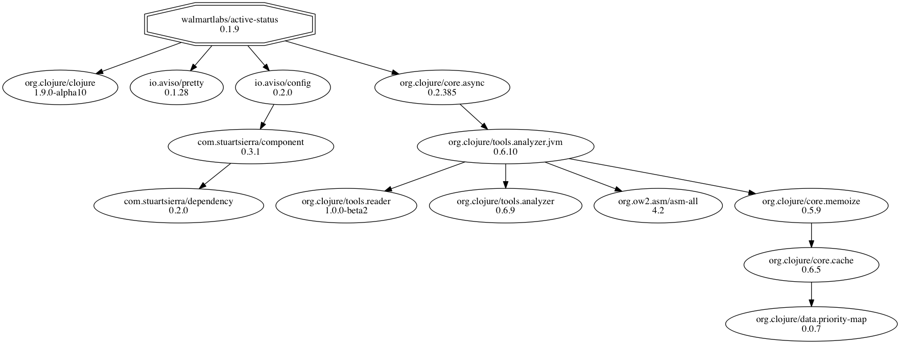
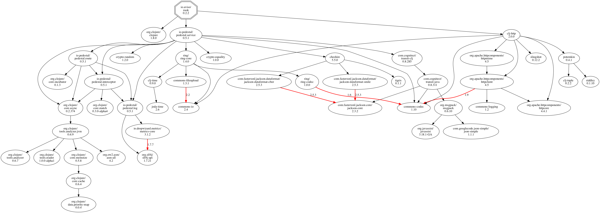
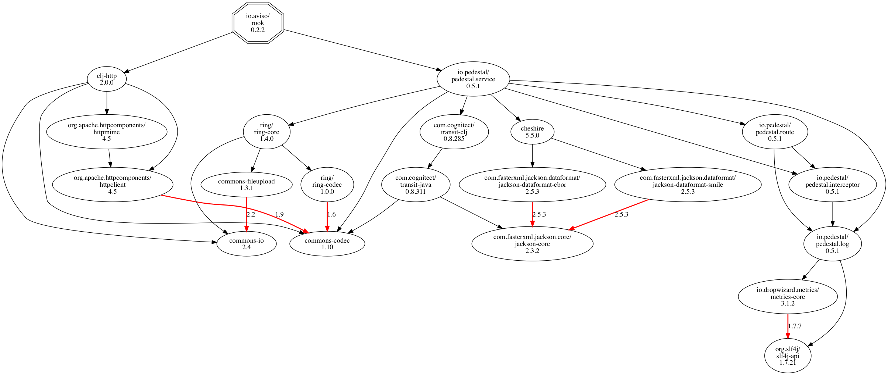
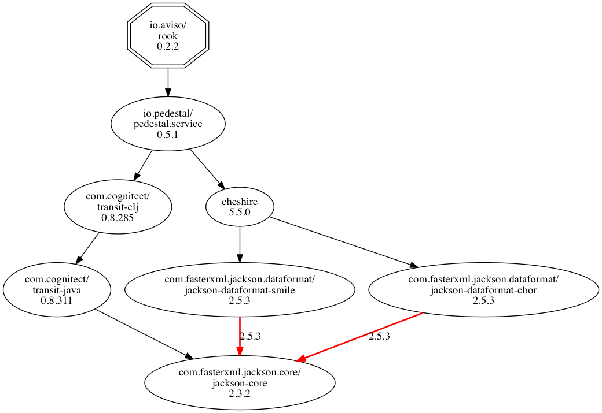
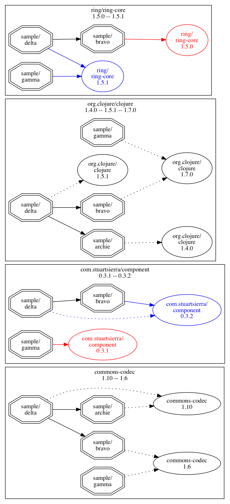

# walmartlabs/vizdeps

[](http://clojars.org/walmartlabs/vizdeps)

> We're moving to [clj-commons](https://github.com/clj-commons/vizdeps)!

An alternative to `lein deps :tree` that uses [Graphviz](http://graphviz.org) to present
a dependency diagram of all the artifacts (Maven-speak for "libraries") in your project.

Here's an example of a relatively small project:



A single artifact may be
a transitive dependency of multiple other artifacts.
`vizdeps` can show this (`lein deps :tree` doesn't), and will highlight in red any dependencies
with a version mismatch.
This can make it *much* easier to identify version conflicts and provide the best
exclusions and overrides.

These dependency graphs can get large; using the `--vertical` option may make large
trees more readable.



To keep the graph from getting any more cluttered, the `org.clojure/clojure` artifact
is treated specially (just the dependency from the project root is shown).

The `--prune` option is used when managing version conflicts; it removes uninteresting artifacts.
Those that remain either have a version conflict (such as `commons-codec`, below) or
transitively depend on an artifact with such a conflict:



Often, you are struck trying to track down why a specific artifact is included.
In large projects, the Graphviz chart can become difficult to read.
Use the `-f` / `--focus` option to limit which artifacts are shown.
For example, `lein vizdeps --vertical --focus jackson-core`:



## Installation

Put `[walmartlabs/vizdeps "0.1.6"]` into the `:plugins` vector of your `:user`
profile.

The plugin makes use of the `dot` command,part of Graphviz,
which must be installed.
On OS X, Graphviz can be installed using [Homebrew](https://brew.sh/):

    brew install graphviz

On other platforms, Graphviz can be [downloaded](http://www.graphviz.org/Download.php).


## vizdeps task

```
Usage: lein vizdeps [options]

Options:
  -d, --dev                                          Include :dev dependencies in the graph.
  -f, --focus ARTIFACT                               Excludes artifacts whose names do not match a supplied value. Repeatable.
  -H, --highlight ARTIFACT                           Highlight the artifact, and any dependencies to it, in blue. Repeatable.
  -n, --no-view                                      If given, the image will not be opened after creation.
  -o, --output-file FILE    target/dependencies.pdf  Output file path. Extension chooses format: pdf or png.
  -p, --prune                                        Exclude artifacts and dependencies that do not involve version conflicts.
  -s, --save-dot                                     Save the generated GraphViz DOT file well as the output file.
  -v, --vertical                                     Use a vertical, not horizontal, layout.
  -h, --help                                         This usage summary.
```

The `--highlight` option can be repeated; any artifact that contains any of the provided strings will be highlighted.

The `--focus` option allows you to mark some dependencies for inclusion; every artifact that does not match, or does not
transitively depend on a marked artifact, is excluded.
This is very useful when trying to work out how a specific artifact is transitively included.

## vizconflicts task

```
Usage: lein vizconflicts [options]

Options:
  -o, --output-file FILE  target/conflicts.pdf  Output file path. Extension chooses format: pdf or png.
  -X, --exclude NAME                            Exclude any project whose name matches the value. Repeatable.
  -a, --artifact NAME                           If given, then only artifacts whose name matches are included. Repeatable.
  -s, --save-dot                                Save the generated GraphViz DOT file well as the output file.
  -n, --no-view                                 If given, the image will not be opened after creation.
  -h, --help                                    This usage summary.
```

`vizconflicts` is used in concert with [lein-sub](https://github.com/kumarshantanu/lein-sub) to analyze
dependencies between and across a multi-module project.
`visconflicts` identifies all artifacts in use across all sub-modules, and identifies where different
versions of the same artifact are used.
The generated document includes a diagram for each artifact that has such version conflicts.

For very large projects, the resulting diagram can be very large (even overwhelming Graphviz's
ability to create a legible layout).
Projects can be excluded, using the `--exclude` option.
Alternately, you can focus on a subset of conflicting artifacts using the `--artifact` option.

When different versions of the same artifact are in use, the output document will include a diagram of how that
artifact is used across the different modules:



The lines in each chart identify dependencies; solid lines are explicit dependencies,
dotted lines are transitive dependencies.

When one version of the artifact is the majority (based on total number of dependencies),
it is highlighted in blue (and other versions are drawn in red).

## License

Copyright © 2016-2017 Walmartlabs

Distributed under the Apache Software License 2.0.
